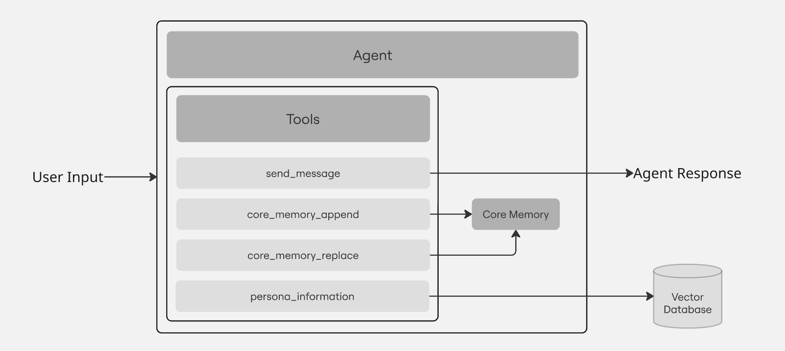

# Letta Agent

## Introduction  

This project demonstrates an **agentic workflow** in conversational agents using the **Letta** Framework. In an agentic workflow, every user message is routed to an agent, which autonomously decides how to handle it. The agent leverages a set of tools to process user inputs effectively.  

The agent in this project embodies the persona of a well-known tech enthusiast. It is designed to:  
- Remember important details about the user using a memory module.  
- Extract personal information about the persona using a Retrieval-Augmented Generation.  

This enables a more personalized, interactive, and context-aware AI experience, making it ideal for applications like AI companions, virtual assistants, and domain-specific chatbots.

- [Letta Agent](#letta-agent)
  - [Introduction](#introduction)
  - [Proposed System](#proposed-system)
    - [Workflow Overview](#workflow-overview)
  - [Features](#features)
    - [Memory-Enabled Conversations](#memory-enabled-conversations)
    - [Persona-Based Information Retrieval](#persona-based-information-retrieval)
    - [Interactive UI with Streamlit](#interactive-ui-with-streamlit)
  - [Tech Stack](#tech-stack)
  - [Guide to Code](#guide-to-code)
    - [1. Install Dependencies](#1-install-dependencies)
    - [2. Launch UI](#2-launch-ui)

## Proposed System

<p align="center">
  
  <br>
  <em>Agentic Workflow and Tools</em>
</p>

### Workflow Overview  

1. **User Input**: The user sends a message to the agent.
    
2. **Agent Processing**: The agent routes the message through its toolset, which includes:  
   - `send_message`: Used to respond to the user. 
  
   - `core_memory_append`: Adds new details to core memory.

   - `core_memory_replace`: Updates existing core memory records. 

   - `persona_information`: Retrieves relevant details about the persona using RAG.

3. **Core Memory & Vector Database**:  
   - The agent interacts with **Core Memory** to retain user-specific details.  
   - A **Vector Database** is used for efficient retrieval of persona-related information. 
 
4. **Agent Response**: The agent processes all retrieved and generated data to formulate a meaningful response back to the user. It uses `send_message` tool to do so.

Here's a structured **"Features"** section tailored to your project:  

## Features  

This project showcases an **agentic workflow** using the **Letta** framework, integrating memory and retrieval capabilities to create a dynamic, persona-driven conversational AI. Below are the key features:  

### Memory-Enabled Conversations  
- The agent remembers important details about the user across interactions.  
- Uses `Core Memory` to store user-specific information.  
- Memory updates can either append new details or replace outdated information.  

### Persona-Based Information Retrieval  
- The agent embodies a well-known tech enthusiast persona.  
- Uses Retrieval-Augmented Generation (RAG) to fetch relevant details about the persona.  
- Ensures responses are contextually accurate and aligned with the persona’s knowledge.  

### Interactive UI with Streamlit  
- A streamlit-based user interface for interacting with the agent.  
- Provides a simple and intuitive experience for users.   

## Tech Stack

```
Core Framework   |   Letta
Language Model   |   o1-mini (OpenAI)
Vector Database  |   Chroma DB
User Interface   |   Streamlit
```

## Guide to Code

### 1. Install Dependencies

```
pip install -r requirements.txt
```

### 2. Launch UI

```
streamlit run streamlit_agent.py
```